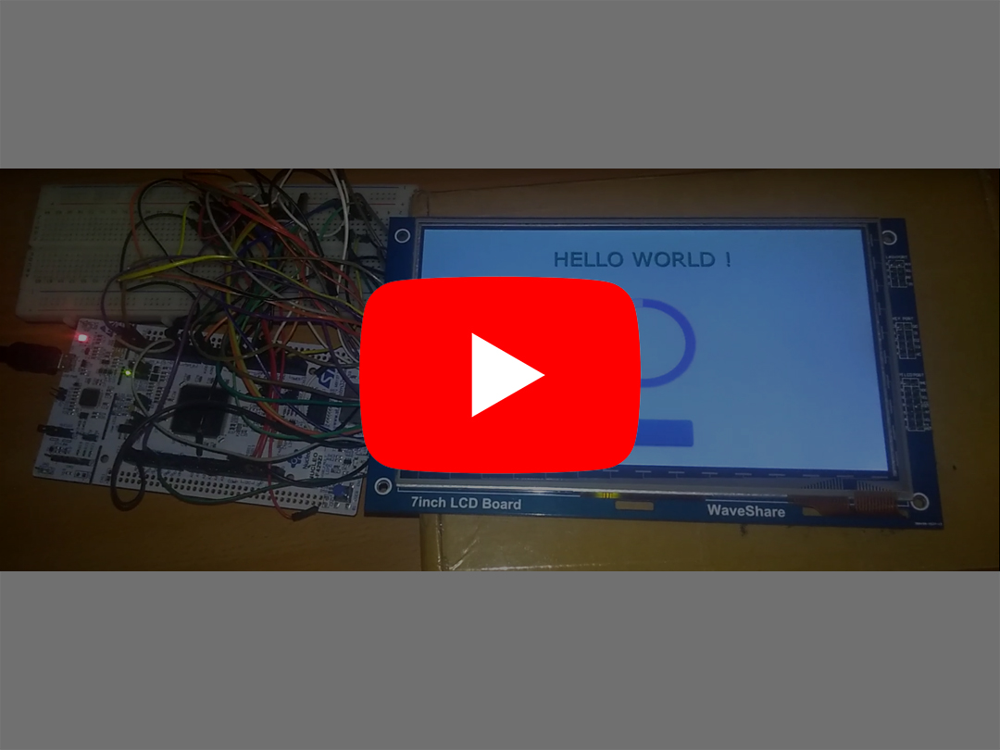

# TEST : Waveshare 7" Capacitive Touch Screen 800x480 + STM32F429ZI + touchGFX
Since we already have some equipment available, we decided to perform some tests in order to measure the difficulties we will face when we will start developing the GUI.
And we thought this might help us select the tools we will use for the project.

## GOALS
- Identify the key components of a display driver
- Test the equipment available

## Equipment
### STM32F429ZI Microcontroller
- 2Mb of Flash Memory 
- 256Kb of RAM
- Up to 180Mhz clock speed
- Chrom-ART accelerator built around a 2D DMA engin
- Embedded LCD-TFT Display Controller __(LTDC)__ (that we didn't use because we don't have the necessary hardware equipment)
- Flexible Memory Controller __(FMC)__ (to interface with external memories)

### Waveshare 7" Touch Screen
- 800x480 resolution
- 16 bits colors
- Embedded Display Controller __(RA8875)__
- Embedded Touch Controller __(GT811)__

## Software tools
- TouchGFX for GUI development

## Aditional informations
For more details about how to :
- Setup the project on your own IDE
- Controll the display
- Get started with TouchFGX
Go to the __WIKI page (currently under construction)__

## Demo Video

